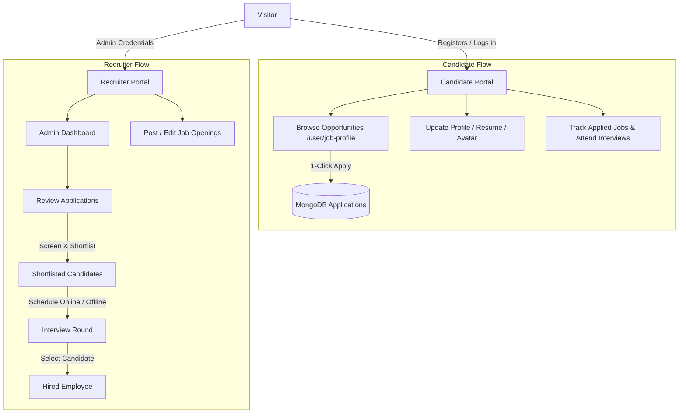

# 💼 Job-App: Enterprise Recruitment & Applicant Tracking System (MERN)

[](https://react.dev/)
[](https://tailwindcss.com/)
[](https://vitejs.dev/)
[](https://nodejs.org/)
[](https://expressjs.com/)
[](https://www.mongodb.com/)
[](LICENSE)

**Job-App** is a full-stack, enterprise-grade Applicant Tracking System (ATS) and hiring management platform built using the MERN stack (MongoDB, Express, React, Node.js). It features dual role-based workflows for **Job Seekers / Candidates** and **Recruiters / Administrators**, offering end-to-end recruitment lifecycle handling from job discovery and 1-click application submission to interview scheduling and hiring onboarding.

---

## 📑 Table of Contents

- [Key Features](#-key-features)
  - [Candidate Portal](#-candidate-portal)
  - [Recruiter & Admin Portal](#-recruiter--admin-portal)
- [System Architecture & Workflow](#-system-architecture--workflow)
- [Technology Stack](#-technology-stack)
- [Project Directory Structure](#-project-directory-structure)
- [Getting Started & Local Setup](#-getting-started--local-setup)
  - [Prerequisites](#prerequisites)
  - [1. Clone Repository](#1-clone-repository)
  - [2. Backend Setup](#2-backend-setup)
  - [3. Frontend Setup](#3-frontend-setup)
  - [4. Database Seeding](#4-database-seeding)
- [Environment Configuration](#-environment-configuration)
- [🔑 Test Credentials (Indian Candidates & Admins)](#-test-credentials-indian-candidates--admins)
- [REST API Reference](#-rest-api-reference)
- [Contributing & License](#-contributing--license)

---

## ✨ Key Features

### 👨‍💼 Candidate Portal

- **SaaS Landing Experience**: Production-grade career portal featuring real-time placement metrics, hiring workflow timelines, and role tags.
- **Interactive Opportunity Browser (`/user/job-profile`)**:
  - Live keyword search across job titles, departments, and work locations.
  - Department filtering pills (Engineering, Frontend, AI/ML, UI/UX, Data Science, Mobile Apps).
  - Tabbed specification pane detailing **Role Overview**, **Hiring Workflow**, and **Eligibility Criteria**.
  - Ultra-slim custom scrollbars (`4px`) with theme-adaptive hover styling.
- **1-Click Application**: Direct job applications with instant duplicate prevention and status synchronization.
- **Application Tracker (`/user/applied-jobs`)**: Searchable tracking grid with tabs for `All`, `Pending`, `Shortlisted`, `Scheduled`, and `Rejected`.
- **Candidate Dossier & Profile Editor (`/user/profile`)**:
  - Profile photo upload with instant preview and Cloudinary storage.
  - Personal information management (Contact, DOB, Gender, Location).
  - Skills and experience management.
  - Multi-tier academic history tracker (Secondary, Higher Secondary, Graduation, Post Graduation).
  - PDF Resume uploader with direct Google Docs viewer integration.
- **Interview Hub (`/user/dashboard`)**:
  - Dynamic KPI cards for submitted, shortlisted, and scheduled rounds.
  - Upcoming interview alert cards with direct Google Meet launch links.

### 🛡️ Recruiter & Admin Portal

- **Recruitment Analytics Dashboard (`/admin/dashboard`)**:
  - Real-time KPI metric cards (Total Candidates, Active Postings, Shortlisted, Interviews).
  - Recent applicant activity stream with candidate avatar initials and domain tags.
- **Application Pipeline Manager (`/admin/applications`)**:
  - Filter applicants by domain, current status, or search query.
  - Integrated status updater modal to advance candidates through the hiring funnel.
- **Interview Scheduling Suite (`/admin/shortlisted`)**:
  - Candidate screening table with candidate CV quick-view links.
  - Dual-mode interview scheduler:
    - **Online**: Generates and links Google Meet or video conference URLs.
    - **Offline**: Captures office venue address and room numbers.
    - Custom notes and instructions field.
- **Requisition & Job Management (`/admin/job-management`)**:
  - Collapsible job creation form with validation (`react-hook-form`).
  - Active opening table with Open/Closed deadline indicators.
  - Multi-field job posting editor and SweetAlert2 deletion confirmation.
- **Candidate Dossier (`/admin/user-profile/:id`)**:
  - In-depth recruiter inspection view displaying verification status (Email, Phone, Role), skills, employment history, and education.
- **Hired Team Directory (`/admin/employee`)**:
  - Searchable directory of onboarded team members.

---

## 🔄 System Architecture & Workflow



---

## 🛠 Technology Stack

### Frontend
- **Core**: [React 19.2](https://react.dev/), [React DOM 19.2](https://reactjs.org/)
- **Build Tool**: [Vite 7.3](https://vitejs.dev/) with `@vitejs/plugin-react`
- **Styling**: [Tailwind CSS v4.1](https://tailwindcss.com/) with `@tailwindcss/vite`
- **Routing**: [React Router DOM 7.1](https://reactrouter.com/)
- **Forms & Validation**: [React Hook Form 7.71](https://react-hook-form.com/)
- **Icons**: [Lucide React](https://lucide.dev/)
- **Alerts & Toasts**: [React Hot Toast](https://react-hot-toast.com/), [SweetAlert2](https://sweetalert2.github.io/)
- **HTTP Client**: [Axios](https://axios-http.com/)

### Backend
- **Runtime**: [Node.js](https://nodejs.org/) (Native ES Modules)
- **Framework**: [Express 5.2](https://expressjs.com/)
- **Database**: [MongoDB Atlas](https://www.mongodb.com/) via [Mongoose 9.1](https://mongoosejs.com/)
- **Authentication**: [JSON Web Tokens (JWT)](https://jwt.io/), [bcrypt](https://github.com/kelektiv/node.bcrypt.js)
- **File Uploads**: [Multer](https://github.com/expressjs/multer), [Cloudinary SDK v2](https://cloudinary.com/)
- **Email & Communications**: [Nodemailer](https://nodemailer.com/), [Twilio SDK](https://www.twilio.com/)
- **Security & Cookies**: [cookie-parser](https://github.com/expressjs/cookie-parser), [cors](https://github.com/expressjs/cors)

---

## 📂 Project Directory Structure

```text
Job-app/
├── backend/
│   ├── config/
│   │   ├── cloudinary.js         # Cloudinary media storage configuration
│   │   └── db.js                 # MongoDB connection handler
│   ├── controllers/
│   │   ├── adminController.js    # Recruiter analytics & applicant queries
│   │   ├── applicationController.js # Job application lifecycle
│   │   ├── authController.js     # User registration, login, logout
│   │   ├── interviewController.js # Interview scheduling & updates
│   │   ├── jobController.js      # Job requisition CRUD
│   │   ├── otpController.js      # Email / phone OTP verification
│   │   └── userController.js     # Profile, avatar & resume updates
│   ├── models/
│   │   ├── Admin.js              # Recruiter schema
│   │   ├── Application.js        # Job application linking User & Job
│   │   ├── EmailLog.js           # Email audit trail
│   │   ├── Interview.js          # Interview schedule records
│   │   ├── Job.js                # Job posting schema
│   │   ├── otp.js                # One-time password verification tokens
│   │   └── User.js               # Candidate account & dossier schema
│   ├── routes/                   # Express modular routers
│   ├── static/
│   │   └── emailData.js          # Responsive transactional email templates
│   ├── .env                      # Backend environment variables
│   ├── index.js                  # Express application entrypoint
│   ├── package.json              # Backend dependencies & scripts
│   └── seed.js                   # Database seeder with Indian candidate profiles
│
├── frontend/
│   ├── public/                   # Static icons and assets
│   ├── src/
│   │   ├── components/           # Navbar, Sidebar, StatCard, 404, Unauthorized
│   │   ├── context/              # AuthContext & AdminContext providers
│   │   ├── layouts/              # DashboardLayout, AdminLayout, UserLayout
│   │   ├── pages/
│   │   │   ├── admin/            # Dashboard, Applications, Shortlisted, Jobs, Dossier
│   │   │   ├── auth/             # Login, Register, Forgot Password
│   │   │   ├── home/             # SaaS Landing Page
│   │   │   └── user/             # Dashboard, JobProfile, AppliedJobs, Profile
│   │   ├── services/
│   │   │   └── api.js            # Configured Axios instance with credentials
│   │   ├── styles/
│   │   │   ├── index.css         # Tailwind v4 directives & custom scrollbars
│   │   │   └── statusColor.js    # Badge styling definitions
│   │   ├── App.jsx               # Application routes
│   │   └── main.jsx              # React DOM bootstrap
│   ├── index.html                # HTML template
│   ├── package.json              # Frontend dependencies & scripts
│   └── vite.config.js            # Vite configuration with Tailwind v4 plugin
│
└── README.md                     # Project documentation
```

---

## 🚀 Getting Started & Local Setup

### Prerequisites

- [Node.js](https://nodejs.org/) (v18.0.0 or higher recommended)
- [npm](https://www.npmjs.com/) (v9.0.0 or higher)
- [MongoDB](https://www.mongodb.com/) (Local instance or MongoDB Atlas cluster connection string)

---

### 1. Clone Repository

```bash
git clone https://github.com/arghyadeep00/Job-app.git
cd Job-app
```

---

### 2. Backend Setup

1. Open a terminal and navigate into the `backend` directory:
   ```bash
   cd backend
   ```
2. Install dependencies:
   ```bash
   npm install
   ```
3. Create and configure your `.env` file (refer to [Environment Configuration](#-environment-configuration)).
4. Start the backend development server:
   ```bash
   npm run dev
   ```
   *The server will start at `http://localhost:3000`.*

---

### 3. Frontend Setup

1. Open a new terminal and navigate into the `frontend` directory:
   ```bash
   cd frontend
   ```
2. Install dependencies:
   ```bash
   npm install
   ```
3. Start the Vite development server:
   ```bash
   npm run dev
   ```
   *The frontend client will start at `http://localhost:5173`.*

---

### 4. Database Seeding

The repository includes an automated seeder script (`backend/seed.js`) that provisions:
- **2 Admins** (Executive & HR)
- **6 Jobs** with complete workflows and requirements
- **6 Indian Candidates** with rich educational dossiers and contact records
- **9 Applications** with distributed pipeline statuses
- **4 Scheduled Interviews** (Online Google Meet & In-person)
- Sample audit logs and OTPs

To seed your MongoDB database:
```bash
cd backend
npm run seed
```

> **Note**: To seed data without wiping existing database documents, pass the `--keep` flag:
> ```bash
> node seed.js --keep
> ```

---

## ⚙️ Environment Configuration

### Backend (`backend/.env`)

```env
# Application Server
PORT=3000
NODE_ENV=development
FRONTEND_URL=http://localhost:5173

# Security
JWT_SECRET=your_super_secret_jwt_key_here

# Database
MONGO_URI=mongodb+srv://<username>:<password>@cluster.mongodb.net/job-app?retryWrites=true&w=majority

# Nodemailer / Transactional Emails (Optional)
EMAIL_USER=your_email@gmail.com
EMAIL_PASS=your_gmail_app_password

# Cloudinary (Optional - For avatar & resume media uploads)
CLOUDINARY_CLOUD_NAME=your_cloud_name
CLOUDINARY_API_KEY=your_cloudinary_key
CLOUDINARY_API_SECRET=your_cloudinary_secret

# Twilio SMS / Phone Verification (Optional)
TWILIO_ACCOUNT_SID=your_account_sid
TWILIO_AUTH_TOKEN=your_auth_token
TWILIO_VERIFY_SERVICE_SID=your_verify_sid
TWILIO_PHONE_NUMBER=your_twilio_number
```

### Frontend (`frontend/.env`)

```env
# URL of your backend API (Required for Vite client requests)
# In production (e.g. Vercel), set this in project Environment Variables:
VITE_BACKEND_URL=http://localhost:3000
```

---

## 🔑 Test Credentials (Indian Candidates & Admins)

After executing `npm run seed`, you can immediately sign in using any of the following accounts:

| Role | User Name | Email Address | Password | Profile Focus |
| :--- | :--- | :--- | :--- | :--- |
| **Admin** | Arghya Banerjee | `admin@jobapp.com` | `AdminPassword123!` | Management & Tech Recruiting |
| **Admin (HR)** | Neha Kapoor | `hr@jobapp.com` | `AdminPassword123!` | Talent Acquisition & Culture |
| **Candidate** | Arjun Kumar Mehta | `arjun.mehta@example.com` | `UserPassword123!` | Full Stack (NIT Trichy, 3 yrs exp) |
| **Candidate** | Ananya Iyer | `ananya.iyer@example.com` | `UserPassword123!` | Frontend (VJTI Mumbai, 1 yr exp) |
| **Candidate** | Aditya Verma | `aditya.verma@example.com` | `UserPassword123!` | AI/ML (IIT Hyderabad / IISc, 3 yrs) |
| **Candidate** | Sneha Reddy | `sneha.reddy@example.com` | `UserPassword123!` | UI/UX Design (NID Ahmedabad, 2 yrs) |
| **Candidate** | Rahul Sharma | `rahul.sharma@example.com` | `UserPassword123!` | Data Science (Delhi University, Fresher) |
| **Candidate** | Priya Patel | `priya.patel@example.com` | `UserPassword123!` | Mobile Apps (GTU, 2 yrs exp) |

---

## 📡 REST API Reference

### Authentication (`/api/auth`)
| Method | Endpoint | Description | Access |
| :--- | :--- | :--- | :--- |
| `POST` | `/api/auth/register` | Register new applicant account | Public |
| `POST` | `/api/auth/login` | Authenticate applicant & set cookie | Public |
| `POST` | `/api/auth/admin-login` | Authenticate recruiter & set cookie | Public |
| `POST` | `/api/auth/logout` | Clear session cookies | Protected |
| `GET` | `/api/auth/check-auth` | Verify current JWT authentication state | Protected |

### Candidate Profile (`/api/user`)
| Method | Endpoint | Description | Access |
| :--- | :--- | :--- | :--- |
| `GET` | `/api/user/profile` | Get current candidate dossier | Candidate |
| `PUT` | `/api/user/profile` | Update candidate name | Candidate |
| `PUT` | `/api/user/personal` | Update phone, gender, DOB, location | Candidate |
| `PUT` | `/api/user/skills` | Update skills list and experience | Candidate |
| `PUT` | `/api/user/education`| Update educational history | Candidate |
| `PUT` | `/api/user/avatar` | Upload profile image | Candidate |
| `PATCH`| `/api/user/resume` | Upload PDF resume | Candidate |

### Jobs & Applications (`/api`)
| Method | Endpoint | Description | Access |
| :--- | :--- | :--- | :--- |
| `GET` | `/api/job/all-jobs` | List all open job requisitions | Public |
| `POST` | `/api/job/apply-job` | Submit application for a job | Candidate |
| `GET` | `/api/job/fetch-applied-jobs` | Get current user's submitted applications | Candidate |
| `POST` | `/api/job/post-job` | Create new job posting | Admin |
| `PATCH`| `/api/job/update-job-details` | Update existing job posting | Admin |
| `DELETE`| `/api/job/delete-job/:id` | Delete job posting | Admin |

### Recruiter & Pipelines (`/api/admin`, `/api/application`, `/api/interview`)
| Method | Endpoint | Description | Access |
| :--- | :--- | :--- | :--- |
| `GET` | `/api/admin/dashboard-stats` | Fetch recruitment metrics & counters | Admin |
| `GET` | `/api/admin/fetch-user/:id` | Fetch full candidate dossier | Admin |
| `GET` | `/api/application/all-applicants` | List all applicant submissions | Admin |
| `GET` | `/api/application/shortlisted-applicants` | List candidates qualified for interview | Admin |
| `PATCH`| `/api/application/status-update` | Update applicant status (Shortlist/Reject) | Admin |
| `POST` | `/api/interview/schedule` | Schedule interview round (Meet / Venue) | Admin |
| `GET` | `/api/interview/candidate-interviews` | Get candidate's scheduled interviews | Candidate |

---

## 📄 Contributing & License

Contributions, issues, and feature requests are welcome! Feel free to check the [issues page](https://github.com/arghyadeep00/Job-app).

Distributed under the **ISC License**. See `LICENSE` for more information.
